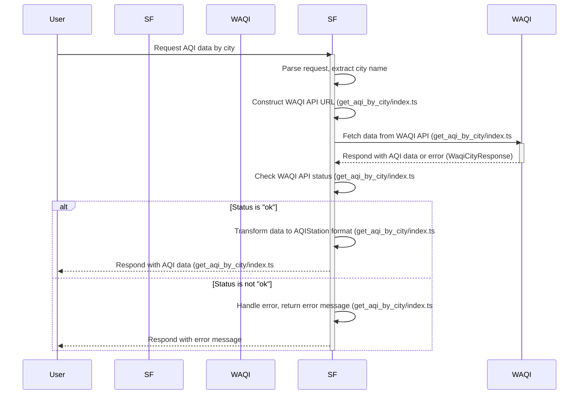
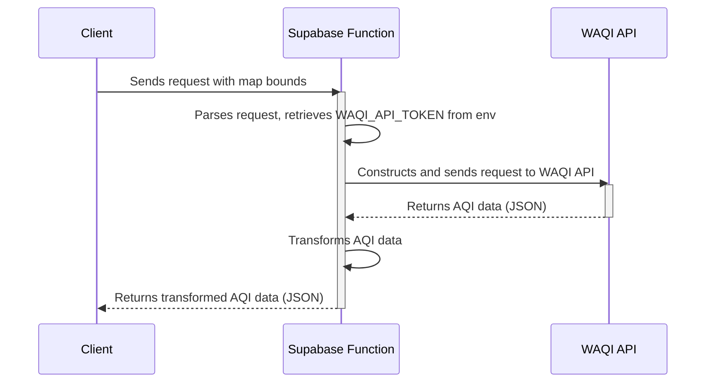
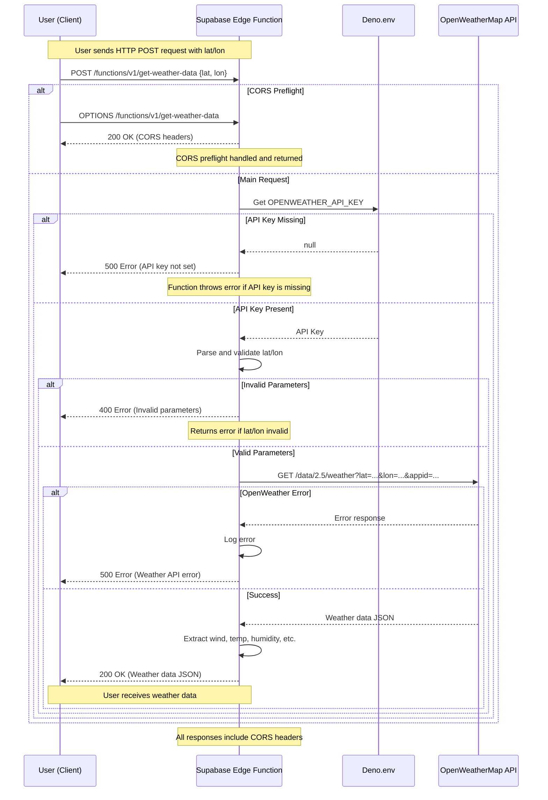
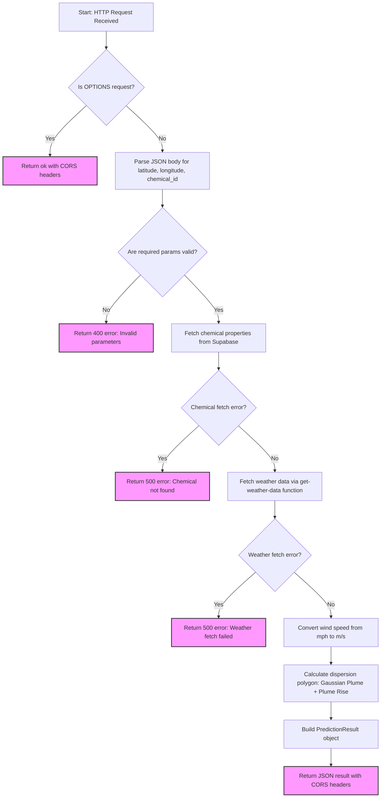

# EnviroSight Supabase Edge Functions

This repository contains Supabase Edge Functions for the EnviroSight project, handling data fetching from external APIs and running environmental models.

## Table of Contents

- [EnviroSight Supabase Edge Functions](#envirosight-supabase-edge-functions)
  - [Table of Contents](#table-of-contents)
  - [Overview](#overview)
  - [Function Documentation](#function-documentation)
    - [Get AQI by City](#get-aqi-by-city)
      - [Process Flow](#process-flow)
      - [Request](#request)
      - [Response](#response)
    - [Get AQI Data by Bounds](#get-aqi-data-by-bounds)
      - [Process Flow](#process-flow-1)
      - [Request](#request-1)
      - [Response](#response-1)
    - [Get Weather Data](#get-weather-data)
      - [Process Flow](#process-flow-2)
      - [Request](#request-2)
      - [Response](#response-2)
    - [Run Dispersion Prediction](#run-dispersion-prediction)
      - [Process Flow](#process-flow-3)
      - [Request](#request-3)
      - [Response](#response-3)
  - [Getting Started](#getting-started)
    - [Prerequisites](#prerequisites)
    - [Setup](#setup)
    - [Local Development](#local-development)
    - [Testing the Edge Functions](#testing-the-edge-functions)
  - [Deployment](#deployment)

## Overview

The Edge Functions provide API endpoints for:

1. **Fetching Air Quality Index (AQI) data:**
   - By city name (`get-aqi-by-city`)
   - Within geographical bounds (`get-aqi-data`)
2. **Fetching current weather data:**
   - For specific coordinates (`get-weather-data`)
3. **Running chemical dispersion predictions:**
   - Based on location, chemical type, and current weather (`run-dispersion-prediction`)

All functions handle CORS preflight requests and return JSON responses.

## Function Documentation

### Get AQI by City

Fetches AQI data for the primary station associated with a specific city name from the WAQI API.

#### Process Flow



#### Request

- **Method:** `POST`
- **Endpoint:** `/functions/v1/get-aqi-by-city`
- **Request Body:**
  ```json
  {
    "city": "YourCityName"
  }
  ```

#### Response

```json
[
  {
    "id": 1437,
    "name": "Beijing",
    "latitude": 39.9167,
    "longitude": 116.4167,
    "value": 155,
    "lastUpdated": "2025-04-23 10:00:00"
  }
]
```

### Get AQI Data by Bounds

Fetches AQI data for all monitoring stations within a specified geographical bounding box.

#### Process Flow



#### Request

- **Method:** `POST`
- **Endpoint:** `/functions/v1/get-aqi-data`
- **Request Body:**
  ```json
  {
    "north": 40.0,
    "south": 39.0,
    "east": -104.0,
    "west": -105.0
  }
  ```

#### Response

```json
[
  {
    "id": 5001,
    "name": "Denver Camp",
    "latitude": 39.75,
    "longitude": -104.98,
    "value": 55,
    "lastUpdated": "2025-04-23 11:00:00"
  }
]
```

### Get Weather Data

Fetches current weather conditions for a specific location using the OpenWeatherMap API.

#### Process Flow



#### Request

- **Method:** `POST`
- **Endpoint:** `/functions/v1/get-weather-data`
- **Request Body:**
  ```json
  {
    "lat": 39.7392,
    "lon": -104.9903
  }
  ```

#### Response

```json
{
  "windSpeed": 10.5,
  "windDirection": 270,
  "temperature": 65.0,
  "humidity": 40,
  "timestamp": "2025-04-23T18:30:00.000Z"
}
```

### Run Dispersion Prediction

Calculates a chemical dispersion plume based on location, chemical properties, and current weather conditions.

#### Process Flow



#### Request

- **Method:** `POST`
- **Endpoint:** `/functions/v1/run-dispersion-prediction`
- **Request Body:**
  ```json
  {
    "latitude": 39.8283,
    "longitude": -98.5795,
    "chemical_id": 1
  }
  ```

#### Response

GeoJSON Feature object representing the predicted plume polygon:

```json
{
  "type": "Feature",
  "properties": {
    "chemical": {
      "id": 1,
      "name": "Ammonia Gas",
      "volatility_level": 8,
      "solubility_level": 9,
      "description": "...",
      "hazard_type": "gas",
      "created_at": "..."
    },
    "weather": {
      "windSpeed": 4.69392,
      "windDirection": 270,
      "temperature": 65.0,
      "humidity": 40,
      "timestamp": "..."
    },
    "timestamp": "2025-04-23T18:35:00.000Z",
    "model_type": "Simplified Gaussian Plume with Briggs Plume Rise"
  },
  "geometry": {
    "type": "Polygon",
    "coordinates": [
      [
        [-98.5795, 39.8283],
        [-98.5780, 39.8285],
        // ...more points...
        [-98.5795, 39.8283]
      ]
    ]
  }
}
```

## Getting Started

### Prerequisites

- [Supabase CLI](https://supabase.com/docs/guides/cli) installed
- Node.js (v16+) and npm installed
- [Deno](https://deno.land/#installation) installed (v1.32.0 or later)
- A Supabase project (free or paid)
- API keys for:
  - [World Air Quality Index (WAQI)](https://aqicn.org/api/)
  - [OpenWeatherMap](https://openweathermap.org/api)

### Setup

1. Clone this repository:
   ```bash
   git clone https://github.com/your-username/enviro-sight-supa-edge.git
   cd enviro-sight-supa-edge
   ```

2. Create a local `.env` file with your API keys:
   ```bash
   echo "WAQI_API_TOKEN=your_waqi_api_token" > .env
   echo "OPENWEATHER_API_KEY=your_openweather_api_key" >> .env
   ```

3. Link your project with the Supabase CLI:
   ```bash
   supabase link --project-ref your-project-reference
   ```

### Local Development

1. Start the local Supabase services:
   ```bash
   supabase start
   ```

2. The CLI will provide local URLs and keys for your development environment.

3. To develop a specific function, use the Supabase CLI's serve command:
   ```bash
   supabase functions serve get-aqi-by-city --env-file .env
   ```

4. Apply database migrations:
   ```bash
   supabase db reset
   ```

5. Seed the database:
   ```bash
   supabase db reset
   ```

### Testing the Edge Functions

Use curl to test the functions locally:

```bash
# Get your local anon key
ANON_KEY=$(supabase status | grep anon | awk '{print $4}')

# Test get-aqi-by-city function
curl -i --location --request POST 'http://127.0.0.1:54321/functions/v1/get-aqi-by-city' \
  --header "Authorization: Bearer $ANON_KEY" \
  --header 'Content-Type: application/json' \
  --data '{"city":"Denver"}'

# Test get-aqi-data function
curl -i --location --request POST 'http://127.0.0.1:54321/functions/v1/get-aqi-data' \
  --header "Authorization: Bearer $ANON_KEY" \
  --header 'Content-Type: application/json' \
  --data '{
    "north": 40.0,
    "south": 39.0,
    "east": -104.0,
    "west": -105.0
  }'

# Test get-weather-data function
curl -i --location --request POST 'http://127.0.0.1:54321/functions/v1/get-weather-data' \
  --header "Authorization: Bearer $ANON_KEY" \
  --header 'Content-Type: application/json' \
  --data '{
    "lat": 39.7392,
    "lon": -104.9903
  }'

# Test run-dispersion-prediction function
curl -i --location --request POST 'http://127.0.0.1:54321/functions/v1/run-dispersion-prediction' \
  --header "Authorization: Bearer $ANON_KEY" \
  --header 'Content-Type: application/json' \
  --data '{
    "latitude": 39.8283,
    "longitude": -98.5795,
    "chemical_id": 1
  }'
```

## Deployment

Deploy your edge functions to your Supabase project:

```bash
# Deploy all functions
supabase functions deploy --project-ref your-project-reference

# Deploy a single function
supabase functions deploy get-weather-data --project-ref your-project-reference
```

Set production environment variables in the Supabase Dashboard:

1. Go to your project dashboard at https://app.supabase.com
2. Navigate to Settings > API
3. Add the following secrets:
   - `WAQI_API_TOKEN`
   - `OPENWEATHER_API_KEY`
   - `SUPABASE_URL` (automatically set)
   - `SUPABASE_ANON_KEY` (automatically set)
   - `SUPABASE_SERVICE_ROLE_KEY` (automatically set)